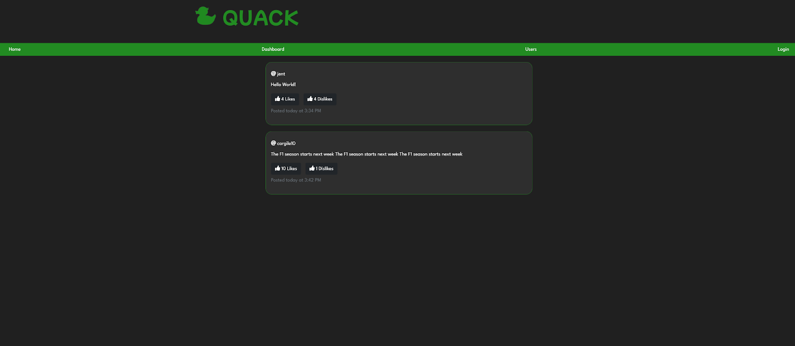

# quack 
## Description
Quack is an application that allows user's to make an account and interact with other users.  Through this interaction they can make a post or comment on another's.  If logged out the user can only see the posts but not the comments that belong to it.  The post is able to be liked or disliked at an umlimited amount of times just to allow the user have fun with it.  It is anonymous to would likes or dislikes the post so it keeps everything private for the user.

## Table of Contents
* [Installation](#Installation)
* [Deployed Link](#Deployed)
* [Preview](#Preview)
* [Wireframe](#Wireframe)
* [Contributing](#Contribution)
* [Questions](#Questions)
* [Licence](#Licence)

## Installation
To install necessary dependencies, run the following command:
- npm i - to install all packages
- npm run seeds

## Deployed Link
[Quack Deployed Link](https://quack-social-media-app.herokuapp.com)

 

[Quack Repo Link](https://github.com/jentruong09/quack)

## Preview

## Wireframe

## Licence

Copyright (c) [2022] [Vy Nguyen, Jennifer Truong, and Colin Cargile]

Permission is hereby granted, free of charge, to any person obtaining a copy of this software and associated documentation files (the "Software"), to deal in the Software without restriction, including without limitation the rights to use, copy, modify, merge, publish, distribute, sublicense, and/or sell copies of the Software, and to permit persons to whom the Software is furnished to do so, subject to the following conditions:

The above copyright notice and this permission notice shall be included in all copies or substantial portions of the Software.

THE SOFTWARE IS PROVIDED "AS IS", WITHOUT WARRANTY OF ANY KIND, EXPRESS OR IMPLIED, INCLUDING BUT NOT LIMITED TO THE WARRANTIES OF MERCHANTABILITY, FITNESS FOR A PARTICULAR PURPOSE AND NONINFRINGEMENT. IN NO EVENT SHALL THE AUTHORS OR COPYRIGHT HOLDERS BE LIABLE FOR ANY CLAIM, DAMAGES OR OTHER LIABILITY, WHETHER IN AN ACTION OF CONTRACT, TORT OR OTHERWISE, ARISING FROM, OUT OF OR IN CONNECTION WITH THE SOFTWARE OR THE USE OR OTHER DEALINGS IN THE SOFTWARE.

For more information, please visit: https://opensource.org/licenses/MIT

## Contributing
[Vy Nguyen](https://github.com/Vy187)
[Jennifer Truong](https://github.com/jentruong09)
[Colin Cargile](https://github.com/jentruong09)

## Questions
If you have any questions about the repo, open an inssue or contact us directly at vy1872@gmail.com, cargile10@gmail.com, or jennifertruong09@gmail.com